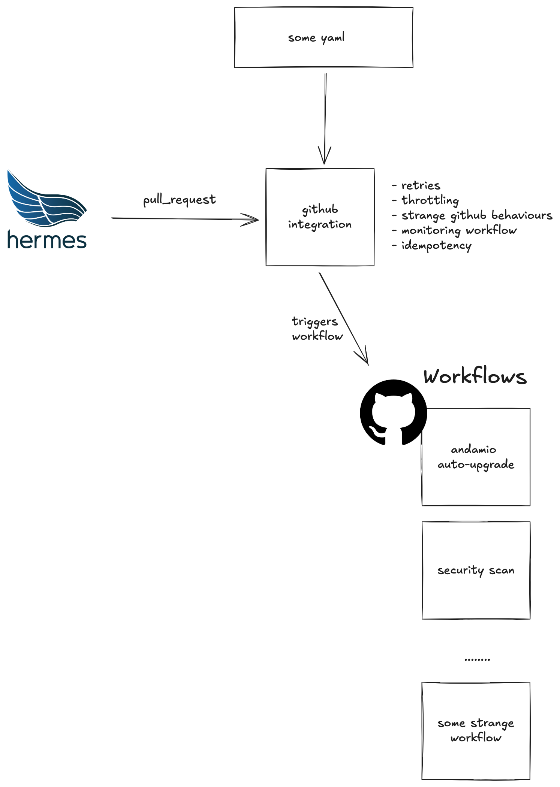

pull-request-manager
==============================

## Context

Intention behind this service is to provide simple way to integrate with Github in our organization:



## How it works

1. You create a github workflow with following input parameters:
    * **event** - which is a raw pull request event from Github. (See more
      in [github docs](https://docs.github.com/en/webhooks/webhook-events-and-payloads#pull_request)).
    * **workflow-concurrency-group** - See [concurrency group docs](./docs/concurrency-group.md)
    * **concurrency-group** - See [concurrency group docs](./docs/concurrency-group.md)
    * **slot-id** - id generated for throttling purpose
    * **check-callback-url** - so you can change status and details of check
    * **comment-callback-url** - so you can comment on given PR
    * **extra-params**
      * **dependabot** - list of all version updates that are mentioned by dependabot
      * **github-clone-token** - (experimental) provides a read-only token scoped to the target repository, which can be used to clone the repo

   Client's workflow should look like this:
    ```yaml
    name: Some workflow

    permissions:
      id-token: write # This is required for requesting the OIDC token (needed for comments)
      contents: read  # This is required for actions/checkout

    on:
      workflow_dispatch:
        inputs:
          slot-id:
            type: text
            required: true
          event:
            type: text
            required: true
          workflow-concurrency-group:
            type: text
            required: true
          concurrency-group:
            type: text
            required: true
          comment-callback-url:
            type: text
            required: true
          check-callback-url:
            type: text
            required: false # it appears only if you add `check` section in configuration
          extra-params:
            type: text # it's json so you need to parse it first
            required: true

    run-name: ${{ inputs.slot-id }}

    concurrency:
      group: ${{ inputs.workflow-concurrency-group }}
      cancel-in-progress: false

    jobs:
      some-job:
        concurrency:
          group: ${{ inputs.concurrency-group }}
          cancel-in-progress: true
    ...
    ```

   If you want to publish comment:
   ```
   ...
   steps:
    run: |
        curl -X POST -H "Content-Type: application/json" -H "Authorization: Bearer $ACTIONS_ID_TOKEN_REQUEST_TOKEN" ${{ inputs.comment-callback-url }} -d '{"body": "some body", "mode": "APPEND"}' # Also OVERWRITE and NEW modes available.
   ```


   And if you want to update check:
   ```
   ...
   steps:
    run: |
        curl -X POST ${{ inputs.check-callback-url }} -H "Content-Type: application/json" --data '{"status": "success"}'
   ```
2. You add entry to configuration in this service (pull-request-manager-config). Example entry looks like that:

```yaml
    some-name:
        id: your-workflow-name
        ref: main # branch or tag from which your workflow will be run
        repository:
            name: repository-name
            owner: allegro-internal
        max-concurrent-runs: 5 # number in range 1-infinity. specifies how many concurrent runs within workflow can be ran (we don't want to overwhelm GH runners)
        concurrency-group: ONE_JOB_PER_PULL_REQUEST # See docs/concurrency-group.md
        filters: # optional -> if not provided every event will be matched
            matching-strategy: ANY # other option is ALL -> should all filters be fulfilled or any of them?
            matchers:
                -   path: "$.action" # json-path syntax
                    regex: "some-value" # value found under provided json-path will be matched with it
                -   files: "src/main/(java|kotlin)/.*" # regex path syntax - by default, GitHub returns only 30 files in the pull request.
                    statuses: ["added", "renamed"] # github file status based on https://docs.github.com/en/rest/pulls/pulls?apiVersion=2022-11-28#list-pull-requests-files
        mapping: # take only essential fields you need in workflow
            paths: # json-path syntax, some examples below
                - "$.repository.owner.login"
                - "$.repository.full_name"
                - "$.pull_request.base.repo"
                - "$.pull_request.base.sha"
                - "$.non-existing-path" # non-existing paths will be ignored and logged in Kibana
        check: # optional. just before dispatching workflow check will be created on PR
            name: "check name" # the name that will be displayed in checks section on PR
            details-page: # things visible after clicking "details" next to check on PR
                title: "title"
                summary: "summary"
                details: "some details" # optional
                custom-url: "https://your-page-with-details.xyz" # optional
```

3. Profit! Your workflow will be triggered as you specified.

## FAQ

> Does it work for all events of type `pull_request` coming from github?

Yes, you should add filters for certain event `action`s in the filters of your workflow.

> How can I check that if my filters are properly configured?

You can go
to [pl.allegro.tech.github.events on Hermes](https://hermes-tech.allegrogroup.com/ui/groups/pl.allegro.tech.github/topics/pl.allegro.tech.github.events), choose
any subscription and debug filters. It should give the same result for single matcher.

Whenever you provide path that does not exist - it will be treat as "not matching" - message about it will be available in logs.

> What happens when triggering workflow fails? Do you provide any retry mechanism?

**In short:** yes.

**Long answer:** Whenever dispatching workflow fails (i.e. due to github unavailability) - we will retry it indefinitely.

> Let's say workflow has been triggered properly. What if the job fails?

Just before dispatching workflow we create a [check on given PR](https://docs.github.com/en/rest/checks/runs?apiVersion=2022-11-28#create-a-check-run) with
details link leading to workflow run. Somebody looking on pull request can re-trigger failed workflow.

> Can my workflow be triggered more than once for single pull request event?

Yes. That's why we require setting up [concurrency group](./docs/concurrency-group.md). Thanks to that approach,
whenever workflow will be triggered second time the new job will start and previous will be cancelled.


> Why field event mapping is enforced? Can't you just send me full event to workflow?

We tried this approach first, however hit Github limits and we were getting 422: `inputs are too large` responses.

> How can I modify PR check status / details?

You get `check-callback-url` as param to your workflow. Send a POST method to it with body:

```json
{
    "status": "failure | success | neutral | in_progress", // conclusion field in https://docs.github.com/en/rest/actions/workflow-runs?apiVersion=2022-11-28#list-workflow-runs-for-a-workflow
    "detailsPage": {
        "title": "some title",
        "summary": "some summary",
        "details": "some details displayed on page",
        "customUrl": "some custom url"
    }
}
```

## Kotlin powered Spring Boot service generated by [New Service](http://newservice.allegrogroup.com)

### Running

* ```./gradlew run```

### Testing

* All tests (unit and integration)
  ```./gradlew check```
* Unit
  ```./gradlew test```
* Integration
  ```./gradlew integrationTest```

### Test logger

You can configure the [test-logger](https://github.com/radarsh/gradle-test-logger-plugin) plugin via the `testlogger`
extension. For example:

```kotlin
testlogger {
    showStandardStreams = true
    showPassedStandardStreams = false
    showSkippedStandardStreams = false
    showFailedStandardStreams = true
}
```

The above config will show logs produced by tests only for failed tests (by default the plugin doesn't show them for any
tests).
See the [plugin docs](https://github.com/radarsh/gradle-test-logger-plugin/blob/develop/README.md) for all
possible configuration options.

