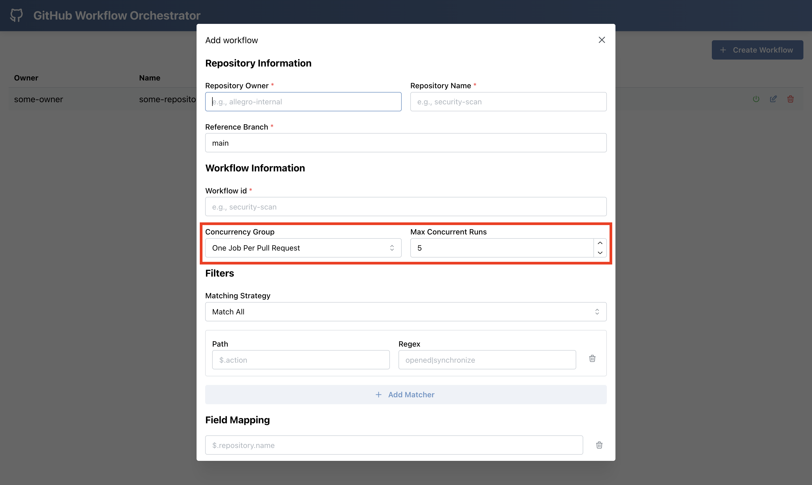

# Concurrency group

Github provides a mechanism
called [concurrency group](https://docs.github.com/en/actions/writing-workflows/choosing-what-your-workflow-does/control-the-concurrency-of-workflows-and-jobs#example-concurrency-groups).

In essence it specifies how many `concurrent jobs` can be run within single group.

github-workflow-orchestrator will deliver you two concurrency groups as paramaters to your workflow:

In `github-workflow-orchestrator` you can specify concurrency-group this way:
- `workflow-concurrency-group`
- `concurrency-group`

### workflow-concurrency-group

You should specify in web UI configuration **how many concurrent runs is allowed within single workflow** via Max concurrent runs field.

Then in workflow, at the top level you should add section like this:

```yaml
concurrency:
    group: ${{ inputs.workflow-concurrency-group }}
    cancel-in-progress: false
```

### concurrency-group

Second concurrency group passed to your workflow is about eliminating redundant workflow runs. In most cases you want to run workflow once per **newest** change
within PR or event within repository.

Available values:

- `ONE_JOB_PER_REPOSITORY` - single job will be run per repository
- `ONE_JOB_PER_PULL_REQUEST` - single job will be run per pull request

(we can extend this list whenever there is usecase for that)

We recommend clients to set concurrency in theirs workflow like that:
Then, we recommend clients to set concurrency in theirs workflow like that on job level:

```yaml
concurrency:
    group: ${{ inputs.concurrency-group }}
    cancel-in-progress: true
```


