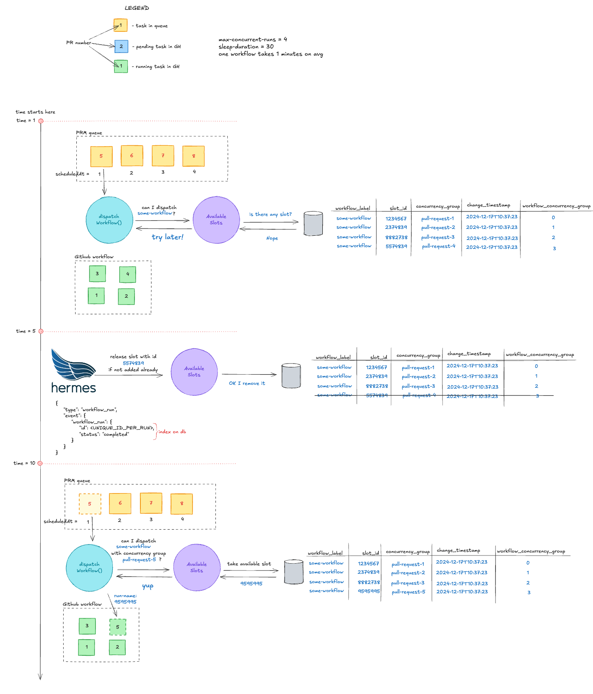

# Max concurrent runs

## Why do we need it?

Github runners are shared resource used to many things in our organization - we don't want to overwhelm it too much.

## Initial idea

Initial idea was to ensure max concurrent runs with concurrency-group, however it turned out that github doesn't queue these runs (there can be only one pending
and one in progress run in the same concurrency group):

https://github.com/orgs/community/discussions/5435

That's why we decided to control amount of concurrency from GitHub Workflow Orchestrator.

## How it works

Diagram says more than 1000 words, so I'll start with it:

## Abandoned ideas

1. `Monitor current state of runs inside workflow`

   We could periodically poll how many runs are within workflow and based on that say if it's possible to dispatch another workflow run

    **Why abandoned:** It would lead to inconsistencies and max-current-runs would be exceeded regularly

2. `Use some rate limiting like 5 requests per minute`

   **Why abandoned:** It would work well in world where we are sure that after dispatching workflow it ends in X seconds
